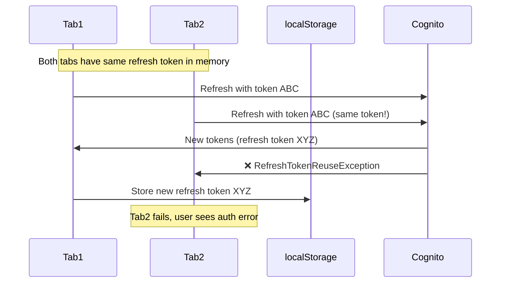
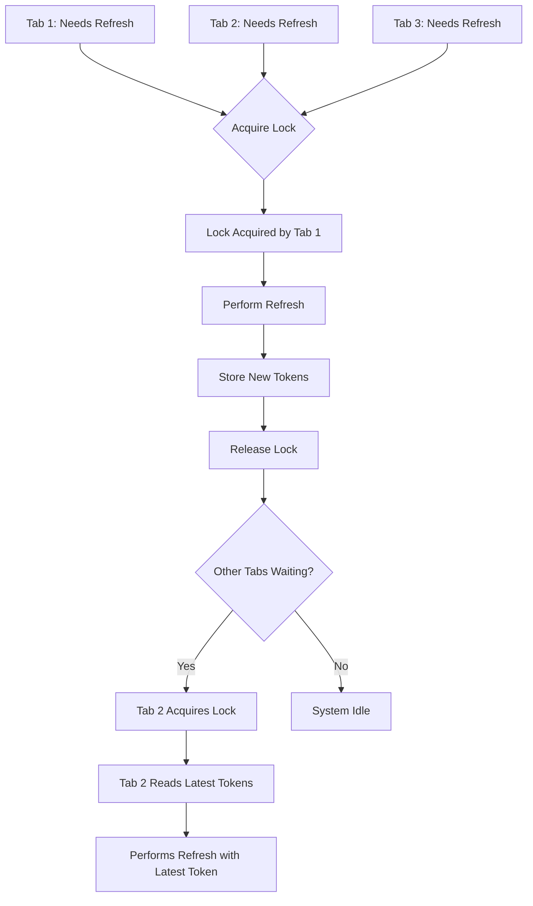
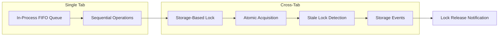
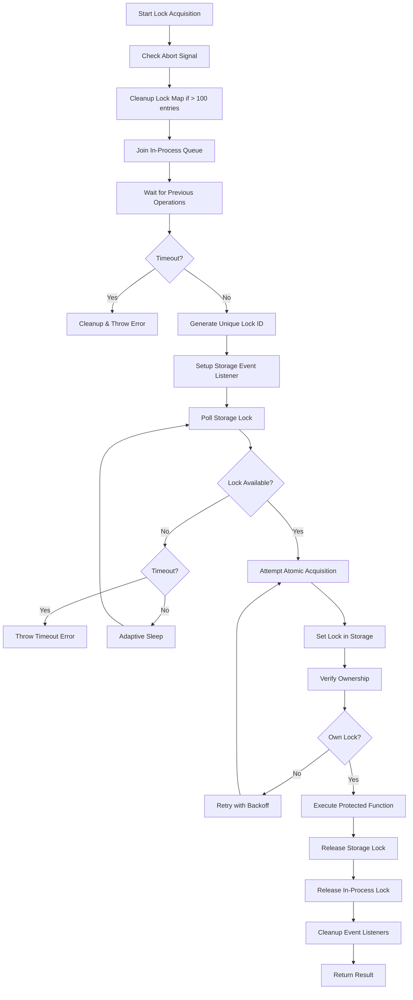
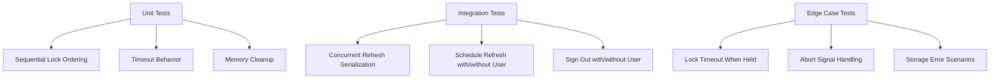

# Cross-Tab Locking Mechanism for RefreshTokenReuseException Prevention

## Table of Contents

1. [Problem Statement](#problem-statement)
2. [Solution Overview](#solution-overview)
3. [Architecture](#architecture)
4. [Implementation Details](#implementation-details)
5. [Improvements Made](#improvements-made)
6. [Testing Strategy](#testing-strategy)
7. [Performance Considerations](#performance-considerations)
8. [Future Considerations](#future-considerations)

## Problem Statement

### The RefreshTokenReuseException Issue

Amazon Cognito implements refresh token rotation as a security feature. When a refresh token is used, Cognito:

1. Issues a new access token
2. Issues a new refresh token
3. Invalidates the old refresh token

**The Problem**: In multi-tab browser environments, race conditions occur:



### Root Cause Analysis

1. **Shared Storage, Separate Memory**: Tabs share localStorage but maintain separate in-memory state
2. **Race Conditions**: Multiple tabs attempt concurrent refresh operations
3. **Stale Token Usage**: Tab B uses old token while Tab A has already refreshed
4. **No Coordination**: No mechanism to serialize refresh operations across tabs

## Solution Overview

We implemented a **Cross-Tab Mutex System** that ensures only one tab can perform refresh operations at a time:



## Architecture

### Two-Layer Locking System



#### Layer 1: In-Process FIFO Queue

- **Purpose**: Serialize operations within the same tab
- **Mechanism**: JavaScript Promise chain
- **Scope**: Single browser tab

#### Layer 2: Storage-Based Lock

- **Purpose**: Coordinate between different tabs
- **Mechanism**: localStorage with unique lock IDs
- **Scope**: All tabs in same origin

### Lock Key Format

```typescript
const lockKey = `Passwordless.${clientId}.${userIdentifier}.refreshLock`;
```

**Rationale**: Per-user locking allows multiple users on same device without blocking each other.

## Implementation Details

### Lock Data Structure

```typescript
interface LockData {
  id: string; // UUID for ownership verification
  timestamp: number; // For stale lock detection
}
```

### Lock Acquisition Flow



### Atomic Lock Acquisition

```typescript
// Prevent race conditions with verify-after-set pattern
await storage.setItem(key, JSON.stringify(lockData));

// Verify we actually own the lock
const verifyValue = await storage.getItem(key);
const verifyLock = parseLockData(verifyValue);

if (verifyLock && verifyLock.id === lockId) {
  // We own the lock
  acquired = true;
} else {
  // Race condition detected, retry
  continue;
}
```

**Rationale**: Simple `setItem` isn't atomic. Two tabs could both see lock as free and both set it. The verify step ensures only one tab proceeds.

### Stale Lock Detection

```typescript
function isLockStale(lockData: LockData): boolean {
  const age = Date.now() - lockData.timestamp;
  return age > STALE_LOCK_TIMEOUT_MS; // 30 seconds
}
```

**Rationale**: If a tab crashes while holding a lock, it would remain forever. Stale detection allows recovery after 30 seconds.

## Improvements Made

### 1. Enhanced Error Handling in Refresh Logic

**Problem**: Only `RefreshTokenReuseException` was retried, but network errors could also cause failures.

**Solution**: Added retry logic for transient network errors:

```typescript
// Retry on multiple error types
if (
  err instanceof Error &&
  (err.name === "NetworkError" ||
    err.message.includes("fetch") ||
    err.message.includes("network") ||
    err.message.includes("timeout"))
) {
  // Retry with exponential backoff
  await new Promise((resolve) => setTimeout(resolve, 1000 * attempt));
  continue;
}
```

**Rationale**: Network issues are common in mobile environments. Retrying transient errors improves reliability.

### 2. Storage Event Reliability Improvements

**Problem**: Browser storage events aren't 100% reliable across all browsers.

**Solution**: Added fallback polling mechanism:

```typescript
// Primary: Storage event listener
globalThis.addEventListener("storage", onStorage);

// Fallback: Periodic checks
const checkInterval = Math.min(DEFAULT_RETRY_DELAY_MS * 2, 200);
storageEventTimeout = setTimeout(function checkStorageFallback() {
  if (!lockReleased) {
    // Continue checking
    storageEventTimeout = setTimeout(checkStorageFallback, checkInterval);
  }
}, checkInterval);
```

**Rationale**: Ensures lock release detection even if storage events are missed or delayed.

### 3. Adaptive Polling Performance Optimization

**Problem**: Fixed 50ms polling could be too aggressive for some scenarios.

**Solution**: Implemented exponential backoff:

```typescript
let pollDelay = DEFAULT_RETRY_DELAY_MS; // Start at 50ms
const maxPollDelay = 500; // Cap at 500ms

// Increase delay after consecutive checks
consecutiveChecks++;
if (consecutiveChecks > 3) {
  pollDelay = Math.min(pollDelay * 1.5, maxPollDelay);
}
```

**Rationale**: Reduces CPU usage in high-contention scenarios while maintaining responsiveness for quick operations.

### 4. Comprehensive Abort Signal Support

**Problem**: Operations couldn't be properly cancelled, leading to resource waste.

**Solution**: Added abort signal propagation throughout the system:

```typescript
// Check abort at multiple points
if (abort?.aborted) {
  throw new DOMException("Operation aborted", "AbortError");
}

// Include in Promise.race for timeouts
const promises = [previous, timeoutPromise];
if (abort) {
  promises.push(abortPromise);
}
```

**Rationale**: Allows proper cleanup when operations are cancelled, preventing resource leaks.

### 5. Configuration Validation

**Problem**: Invalid configuration values could cause runtime errors.

**Solution**: Added strict type checking:

```typescript
useGetTokensFromRefreshToken: typeof config.useGetTokensFromRefreshToken ===
"boolean"
  ? config.useGetTokensFromRefreshToken
  : config.useGetTokensFromRefreshToken == null
    ? true
    : (() => {
        throw new Error(
          `Invalid configuration: useGetTokensFromRefreshToken must be a boolean`
        );
      })();
```

**Rationale**: Fail fast with clear error messages rather than silent failures or unexpected behavior.

### 6. Memory Leak Prevention

**Problem**: In-process lock map could grow indefinitely in long-running applications.

**Solution**: Added automatic cleanup:

```typescript
const MAX_LOCK_ENTRIES = 100;

function cleanupLockMapIfNeeded(): void {
  if (inProcessLockMap.size > MAX_LOCK_ENTRIES) {
    debug?.(
      `withStorageLock: cleaning up lock map, size was ${inProcessLockMap.size}`
    );
    inProcessLockMap.clear();
  }
}
```

**Rationale**: Prevents memory leaks while being generous enough for normal browser usage patterns.

### 7. Enhanced Debug Logging

**Problem**: Difficult to troubleshoot lock-related issues in production.

**Solution**: Added comprehensive timing and context information:

```typescript
debug?.("withStorageLock: acquired lock", key, {
  lockId,
  attempt,
  elapsedMs: Date.now() - start,
});
```

**Rationale**: Enables effective debugging and monitoring of lock performance in production.

## Testing Strategy

### Test Coverage



### Key Test Scenarios

1. **Sequential Ordering**: Ensures locks are acquired in FIFO order
2. **Timeout Handling**: Verifies proper cleanup on timeout
3. **Concurrent Operations**: Tests serialization of refresh operations
4. **Memory Management**: Validates cleanup mechanism works
5. **Error Conditions**: Tests behavior under various failure modes

## Performance Considerations

### Memory Usage

| Component      | Memory per Entry | Max Entries   | Total Memory |
| -------------- | ---------------- | ------------- | ------------ |
| Lock Map       | ~400 bytes       | 100           | ~40KB        |
| Storage Events | ~100 bytes       | Per tab       | ~100 bytes   |
| Debug Logs     | ~50 bytes        | Per operation | Minimal      |

### CPU Impact

- **Polling**: Adaptive from 50ms to 500ms
- **Storage Operations**: Minimal (localStorage is fast)
- **Event Handling**: Negligible overhead

### Network Impact

- **No additional network calls** for locking mechanism
- **Reduced network calls** due to prevented duplicate refreshes

## Future Considerations

### Potential Improvements

1. **BroadcastChannel API**: Could replace storage events for better cross-tab communication
2. **IndexedDB Locks**: For more sophisticated locking scenarios
3. **Service Worker Coordination**: For background refresh coordination
4. **Metrics Collection**: For monitoring lock performance in production

### Browser Compatibility

- **Storage Events**: Supported in all modern browsers
- **AbortController**: IE11 requires polyfill
- **Crypto.randomUUID**: Fallback implemented for older browsers

### Scalability Considerations

The current implementation is optimized for browser environments with:

- **Single user per session** (typical browser usage)
- **Limited concurrent operations** (few tabs)
- **Natural cleanup boundaries** (page refresh, tab close)

For server-side usage, additional considerations would be needed:

- **Distributed locking** mechanisms
- **Database-backed coordination**
- **Process crash recovery**

## Conclusion

The implemented cross-tab locking mechanism successfully addresses the RefreshTokenReuseException problem while providing:

✅ **Reliability**: Prevents token reuse errors through proper serialization  
✅ **Performance**: Minimal overhead with adaptive optimizations  
✅ **Robustness**: Handles edge cases, errors, and browser differences  
✅ **Maintainability**: Clear code structure with comprehensive testing  
✅ **Scalability**: Efficient memory usage with automatic cleanup
