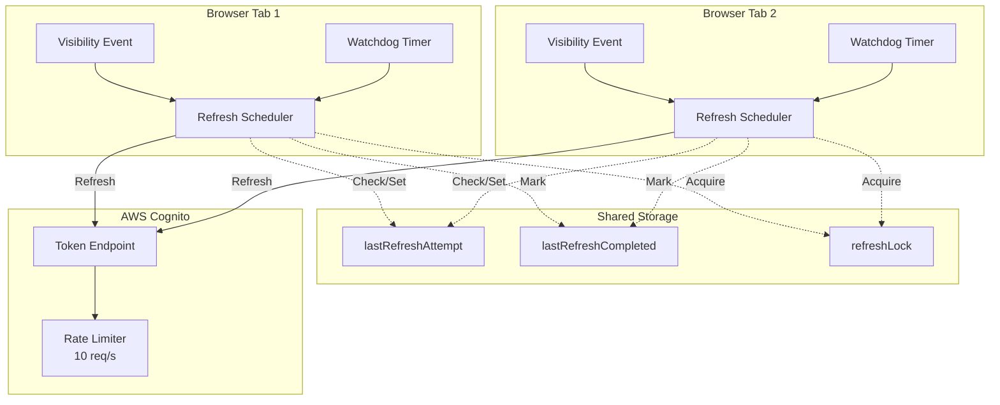
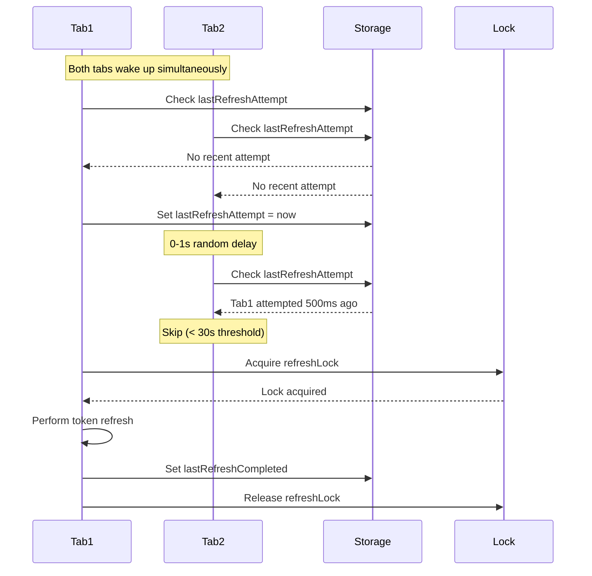
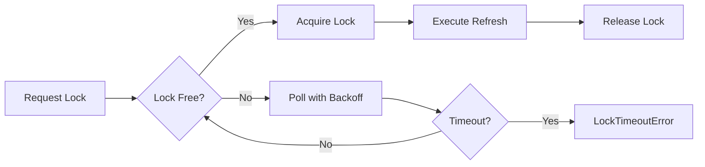
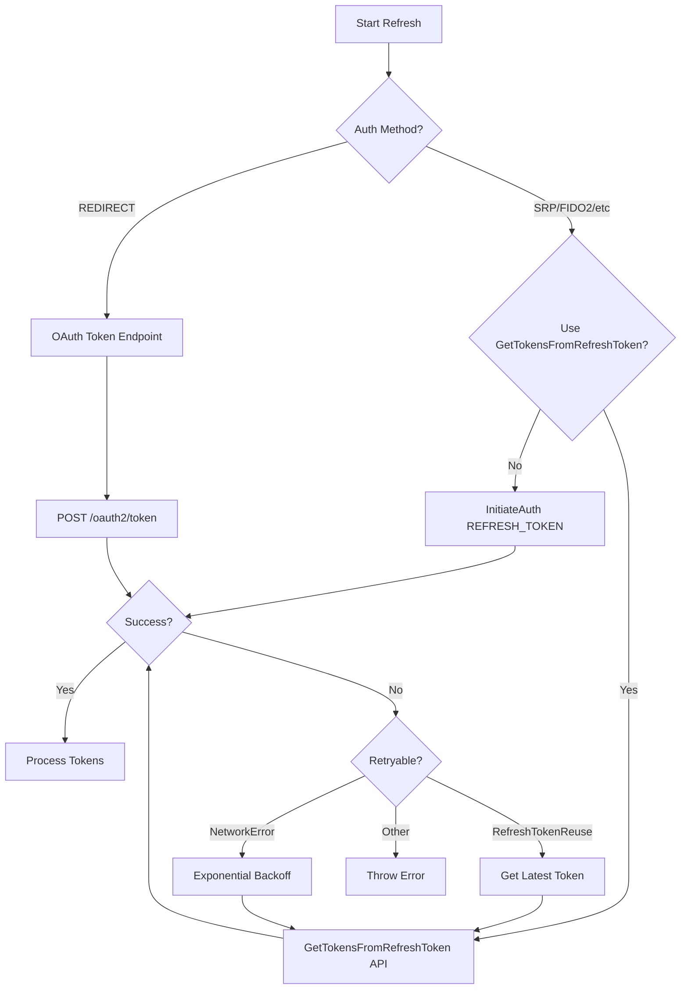
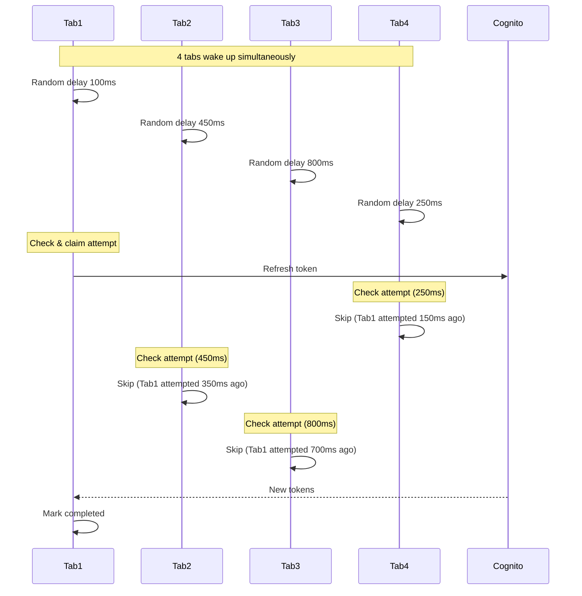
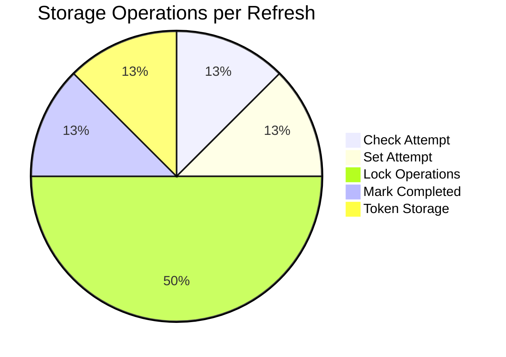

# Token Refresh Flow - Technical Documentation

## Overview

The token refresh system is designed to handle AWS Cognito token renewal across multiple browser tabs while preventing rate limit violations (10 req/s) and thundering herd problems.

## Architecture



## Core Components

### 1. Event Triggers

Three mechanisms can initiate token refresh:

```typescript
// a) Visibility Change Handler (0-1s random delay)
document.addEventListener("visibilitychange", handleVisibilityChange);

// b) Watchdog Timer (5-minute intervals)
const WATCHDOG_INTERVAL_MS = 5 * 60 * 1000;

// c) Scheduled Refresh (dynamic timing based on token lifetime)
setTimeoutWallClock(refreshCallback, refreshDelay);
```

### 2. Multi-Tab Coordination

The system uses a two-phase coordination mechanism:



## Refresh Decision Flow

### Phase 1: Should Attempt Refresh?

```typescript
async function shouldAttemptRefresh(): Promise<boolean> {
  // 1. Get last attempt timestamp
  const lastAttemptStr = await storage.getItem(attemptKey);
  
  // 2. Check if someone attempted within 30 seconds
  if (timeSinceLastAttempt < 30000) {
    return false; // Another tab is handling it
  }
  
  // 3. Mark our attempt (race window exists here)
  await storage.setItem(attemptKey, Date.now().toString());
  return true;
}
```

### Phase 2: Lock Acquisition



**Lock Implementation Details:**
- **Unique Lock ID**: Prevents race conditions
- **Timestamp**: Enables stale lock detection (30s timeout)
- **Storage Events**: Fast lock release detection
- **Adaptive Polling**: 50ms → 75ms → 112ms → ... → 500ms (max)

## Token Refresh Timing

### Dynamic Buffer Calculation

```typescript
// Extract actual token lifetime from JWT
const actualLifetime = (payload.exp - payload.iat) * 1000;

// Calculate buffer (30% of lifetime, bounded)
const bufferTime = Math.max(
  60000,                    // Min: 1 minute
  Math.min(
    0.3 * actualLifetime,   // 30% of lifetime
    15 * 60 * 1000         // Max: 15 minutes
  )
);

// Schedule refresh before expiry
const refreshDelay = timeUntilExpiry - bufferTime;
```

### Timing Scenarios

```mermaid
gantt
    title Token Lifetime and Refresh Timing
    dateFormat X
    axisFormat %M:%S
    
    section 1hr Token
    Token Valid          :active, t1, 0, 3600
    Buffer (18min)       :crit, b1, 2520, 3600
    Refresh Window       :milestone, 2520, 0
    
    section 15min Token  
    Token Valid          :active, t2, 0, 900
    Buffer (4.5min)      :crit, b2, 630, 900
    Refresh Window       :milestone, 630, 0
    
    section 5min Token
    Token Valid          :active, t3, 0, 300
    Buffer (1min)        :crit, b3, 240, 300
    Refresh Window       :milestone, 240, 0
```



## Refresh Execution Flow

### OAuth vs Cognito API Decision



### Retry Logic

```typescript
for (let attempt = 1; attempt <= 3; attempt++) {
  try {
    // Attempt refresh
    authResult = await getTokensFromRefreshToken({...});
    break;
  } catch (err) {
    if (err.name === "RefreshTokenReuseException") {
      // Get latest token from storage
      currentRefreshToken = latestStored?.refreshToken;
    } else if (isNetworkError(err) && attempt < 3) {
      // Wait with exponential backoff: 1s, 2s, 3s
      await sleep(1000 * attempt);
    } else {
      throw err;
    }
  }
}
```

## Rate Limit Protection

### Thundering Herd Prevention



**Protection Mechanisms:**
1. **Random Delay**: 0-1 second prevents simultaneous attempts
2. **30-Second Window**: Only one refresh per 30s across all tabs
3. **Storage Lock**: Serializes actual refresh operations
4. **Lock Timeout**: 5 seconds prevents deadlocks

## Performance Characteristics

### Latency Analysis

| Scenario | Min Latency | Max Latency | Notes |
|----------|-------------|-------------|-------|
| Tab Wake | 0ms | 1000ms | Random delay |
| Lock Acquisition | 0ms | 5000ms | Timeout limit |
| Refresh API Call | 200ms | 3000ms | Network dependent |
| Total E2E | 200ms | 9000ms | Worst case with retries |

### Storage Operations



Total: ~8 storage operations per successful refresh

## Edge Cases Handled

1. **Stale Locks**: Automatically cleared after 30 seconds
2. **Race Conditions**: Unique lock IDs with verification
3. **Network Failures**: 3 retries with exponential backoff
4. **Token Rotation**: Handles RefreshTokenReuseException
5. **Browser Hibernation**: Watchdog ensures eventual refresh
6. **Storage Failures**: Fail-open design allows refresh attempt

## Key Design Decisions

1. **Simplified State Machine**: Just timestamps instead of complex states
2. **Fail-Open Philosophy**: Storage errors don't block refresh
3. **Minimal Coordination**: 30-second window is sufficient
4. **No In-Process Queue**: Reduces complexity, relies on storage lock
5. **Dynamic Timing**: Adapts to actual token lifetime

## Implementation Files

- **`client/refresh.ts`**: Main refresh logic and scheduling
- **`client/lock.ts`**: Storage-based locking mechanism
- **`client/retry.ts`**: Exponential backoff retry logic

The system achieves its goal of preventing Cognito rate limit violations while maintaining token freshness across multiple browser tabs with minimal complexity.
