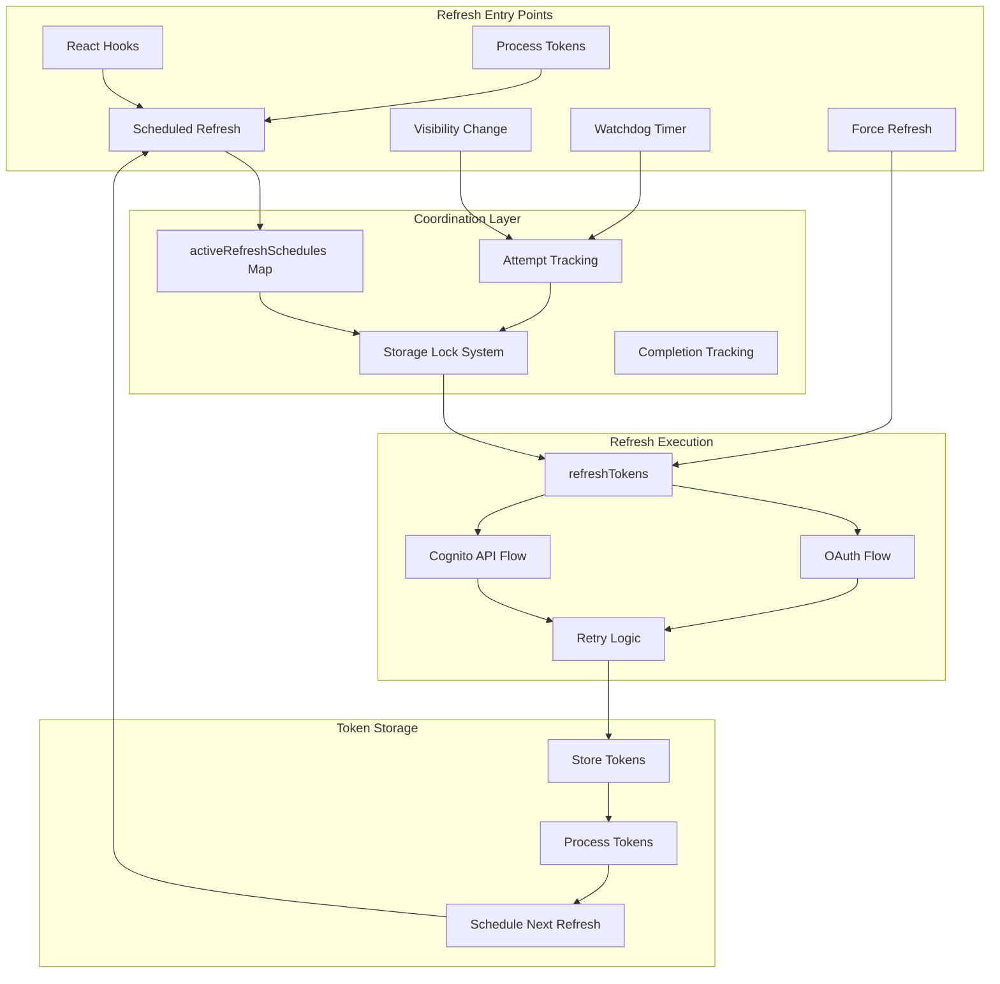
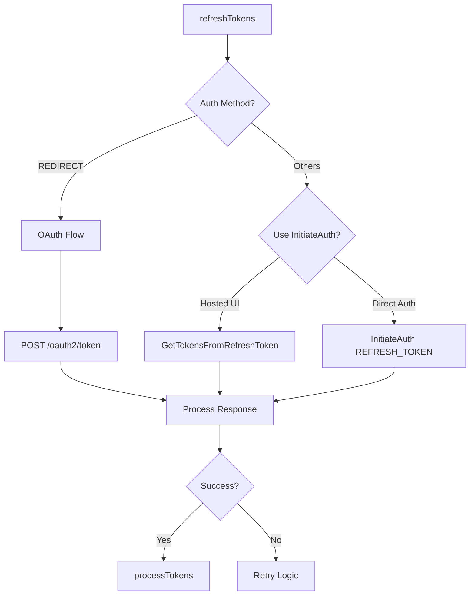

# Token Refresh System - Technical Documentation

## Overview

The token refresh system ensures AWS Cognito tokens stay fresh across multiple browser tabs, different authentication methods, and various edge cases. It prevents token expiration while avoiding rate limit violations and refresh storms.

## Architecture



## Refresh Entry Points

### 1. Automatic Scheduled Refresh

**Location**: `client/refresh.ts` - `scheduleRefresh()`

Automatically scheduled after any successful authentication or token refresh.

```typescript
// Dynamic timing calculation
const actualLifetime = (payload.exp - payload.iat) * 1000;
const bufferTime = Math.max(
  60000, // Min: 1 minute
  Math.min(
    0.3 * actualLifetime, // 30% of lifetime
    15 * 60 * 1000 // Max: 15 minutes
  )
);
const refreshDelay = timeUntilExpiry - bufferTime;
```

**Special Cases**:

- Tokens expiring in <60s: Refresh immediately
- Fresh logins: 2-minute delay before first refresh schedule
- Uses `setTimeoutWallClock` to handle device sleep

### 2. Visibility Change Handler

**Location**: `client/refresh.ts` - `handleVisibilityChange()`

Triggered when browser tab becomes visible.

```typescript
// Conditions for refresh on visibility:
- Document becomes visible
- No refresh in progress or scheduled soon
- >60 seconds since last refresh
- Random 0-1s delay to prevent thundering herd
```

### 3. Watchdog Timer

**Location**: `client/refresh.ts` - `startRefreshWatchdog()`

Safety net that runs every 5 minutes.

```typescript
// Watchdog triggers refresh if:
- No refresh timer scheduled
- Document is visible
- >5 minutes since last refresh
```

### 4. Manual Force Refresh

**Location**: `client/refresh.ts` - `forceRefreshTokens()`

User-initiated refresh via React hooks.

```typescript
// Force refresh behavior:
- Cancels any scheduled refresh
- Forces immediate refresh (bypasses coordination)
- Reschedules next automatic refresh
```

### 5. React Hook Auto-Refresh

**Location**: `client/react/hooks.tsx`

Multiple triggers within React components:

- On component mount when tokens exist
- When tokens become available
- On authentication errors requiring refresh
- When handling incomplete token sets

### 6. Process Tokens Integration

**Location**: `client/common.ts` - `processTokens()`

Called after every authentication/refresh to ensure scheduling.

```typescript
// Fresh login vs token refresh:
if ("newDeviceMetadata" in tokens) {
  // Fresh login - delay by 2 minutes
  setTimeout(scheduleFn, FRESH_LOGIN_REFRESH_DELAY_MS);
} else {
  // Token refresh - schedule immediately
  scheduleFn();
}
```

## Multi-Tab Coordination

### Storage-Based Lock System

**Location**: `client/lock.ts`

Prevents concurrent refreshes across tabs.

```typescript
interface StorageLock {
  id: string;        // Unique identifier
  timestamp: number; // For stale lock detection
}

// Lock characteristics:
- 15-second acquisition timeout
- 30-second stale lock detection
- Storage events for fast release detection
- Adaptive polling: 50ms → 75ms → ... → 500ms
```

### Active Refresh Schedules Map

**Location**: `client/common.ts`

In-memory deduplication within a single tab.

```typescript
const activeRefreshSchedules = new Map<
  string,
  {
    scheduledAt: number;
    abortController: AbortController;
    refreshToken: string;
  }
>();

// Prevents duplicate schedules for 5 minutes
const REFRESH_DEDUPLICATION_WINDOW_MS = 300000;
```

### Refresh Attempt Coordination

**Location**: `client/refresh.ts`

Cross-tab coordination via localStorage.

```typescript
// Storage keys per user:
`Passwordless.${clientId}.${username}.lastRefreshAttempt`
`Passwordless.${clientId}.${username}.lastRefreshCompleted`

// Coordination windows:
- 5-second cooldown between attempts
- 0-100ms random jitter
- Check if another tab refreshed while waiting
```

## Refresh Execution Flow

### OAuth vs Cognito API Decision



### Retry Logic

```typescript
// Maximum 3 retry attempts with different strategies:
for (let attempt = 1; attempt <= 3; attempt++) {
  try {
    authResult = await refreshTokenAPI();
    break;
  } catch (error) {
    if (error.name === "RefreshTokenReuseException") {
      // Fetch latest refresh token from storage
      currentRefreshToken = (await retrieveTokens())?.refreshToken;
    } else if (isNetworkError(error) && attempt < 3) {
      // Exponential backoff: 1s, 2s, 3s
      await sleep(1000 * attempt);
    } else {
      throw error;
    }
  }
}
```

### Token Processing Pipeline

1. **Refresh API Call** → New tokens received
2. **processTokens()** → Normalize and store tokens
3. **Schedule Next Refresh** → Calculate timing and schedule
4. **Callback Execution** → Notify listeners of new tokens

## Error Handling and Edge Cases

### Handled Scenarios

1. **Stale Locks**: Automatically cleared after 30 seconds
2. **Race Conditions**: Unique lock IDs with timestamp verification
3. **Network Failures**: 3 retries with exponential backoff
4. **Token Rotation**: Handles RefreshTokenReuseException
5. **Browser Hibernation**: Watchdog ensures eventual refresh
6. **Storage Failures**: Fail-open design allows refresh attempt
7. **Concurrent Tabs**: Lock system serializes operations
8. **User Sign-out**: Aborts scheduled refreshes and clears tracking

### Failed Refresh Recovery

```typescript
// On scheduled refresh failure:
- Clear any locks/tracking
- Wait 30 seconds before retry
- Log error for debugging

// On manual refresh failure:
- Throw error to caller
- Let UI handle user feedback
```

## Performance Characteristics

### Timing Analysis

| Operation        | Duration   | Notes             |
| ---------------- | ---------- | ----------------- |
| Lock Acquisition | 0-15s      | Usually <100ms    |
| Refresh API Call | 200-3000ms | Network dependent |
| Token Processing | <50ms      | Storage writes    |
| Total Refresh    | 250-3500ms | Typical case      |

### Storage Operations

Per successful refresh:

- 2 reads: Check attempt/completion
- 1 write: Mark attempt
- 4-6 operations: Lock acquire/release
- 1 write: Mark completion
- Multiple writes: Store tokens
- **Total**: ~10-15 storage operations

## Configuration

### Timing Constants

```typescript
// Deduplication and delays
REFRESH_DEDUPLICATION_WINDOW_MS = 300000; // 5 minutes
FRESH_LOGIN_REFRESH_DELAY_MS = 120000; // 2 minutes

// Coordination windows
REFRESH_ATTEMPT_INTERVAL_MS = 5000; // 5 seconds
REFRESH_ATTEMPT_JITTER_MS = 100; // 0-100ms random

// Watchdog
WATCHDOG_INTERVAL_MS = 300000; // 5 minutes

// Lock timeouts
DEFAULT_LOCK_TIMEOUT_MS = 15000; // 15 seconds
STALE_LOCK_THRESHOLD_MS = 30000; // 30 seconds
```

### Per-User Isolation

All refresh operations are isolated per user:

- Separate storage keys include username
- Independent refresh schedules
- Isolated lock management
- No cross-user interference

## Implementation Files

- **`client/refresh.ts`**: Core refresh logic and scheduling
- **`client/common.ts`**: Token processing and schedule management
- **`client/lock.ts`**: Storage-based locking mechanism
- **`client/retry.ts`**: Network retry logic
- **`client/react/hooks.tsx`**: React integration and auto-refresh

## Key Design Decisions

1. **Multiple Entry Points**: Redundancy ensures tokens stay fresh
2. **Fail-Open Philosophy**: Storage errors don't block critical operations
3. **Per-User Isolation**: Multi-user support without interference
4. **Dynamic Timing**: Adapts to actual token lifetimes
5. **Minimal Coordination**: Simple timestamp-based coordination
6. **No Central State**: Each tab manages its own state
7. **Progressive Enhancement**: Works with or without advanced features
