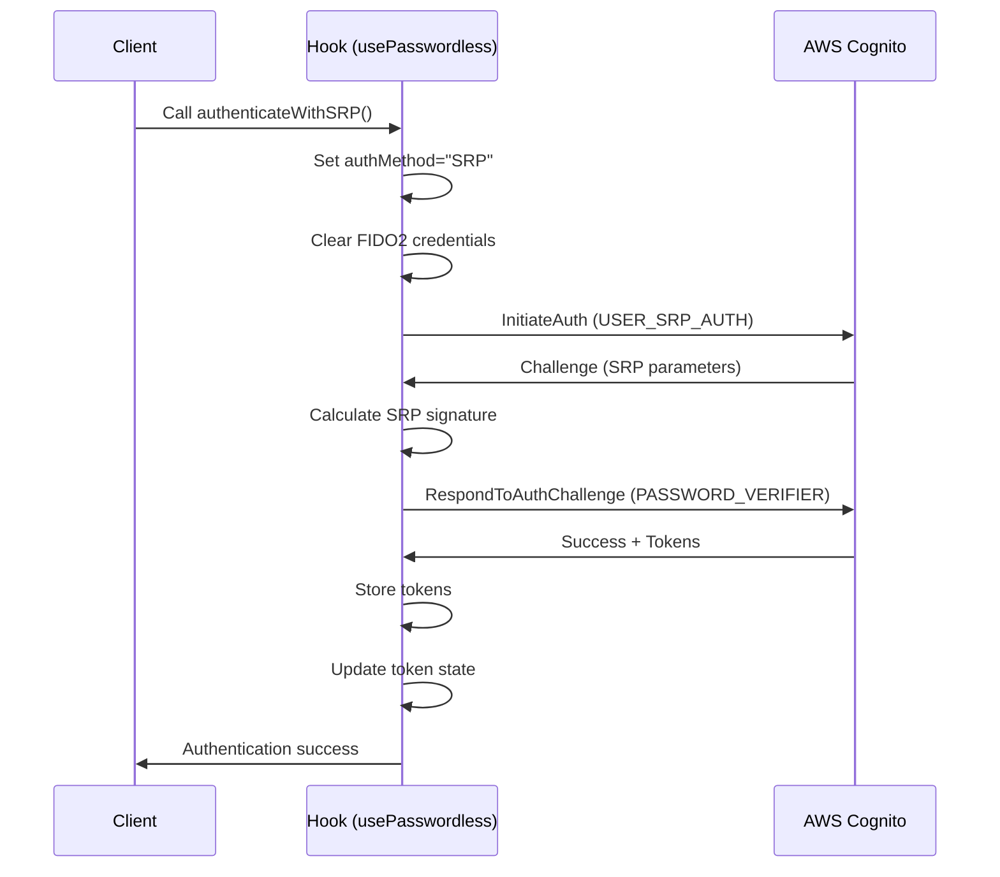
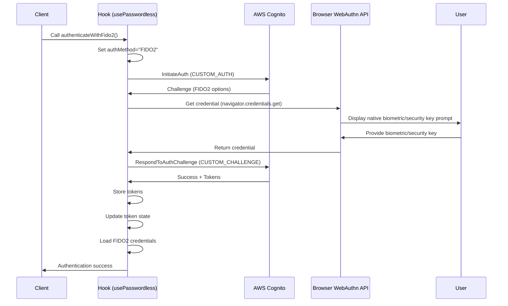
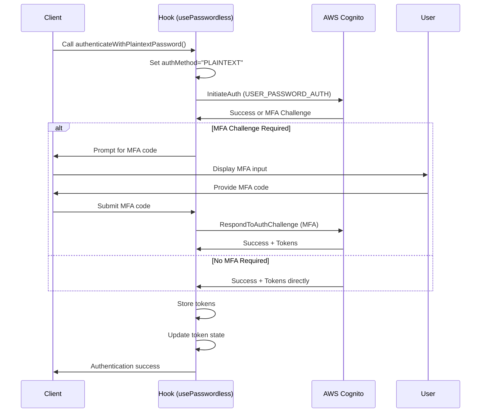
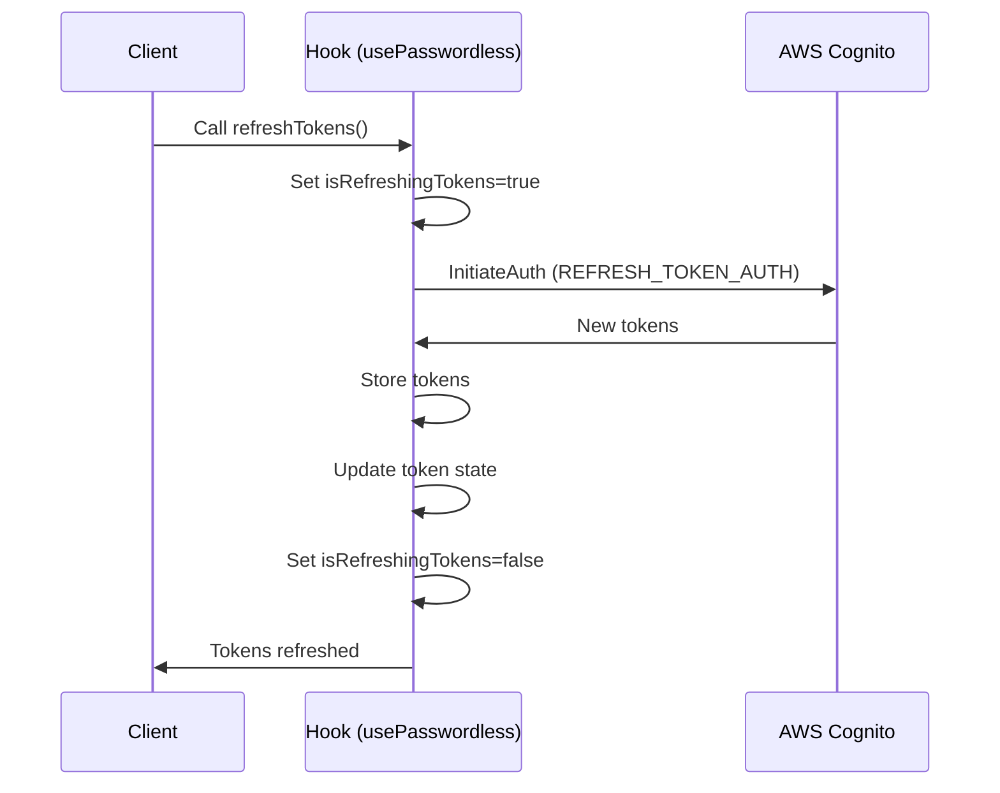
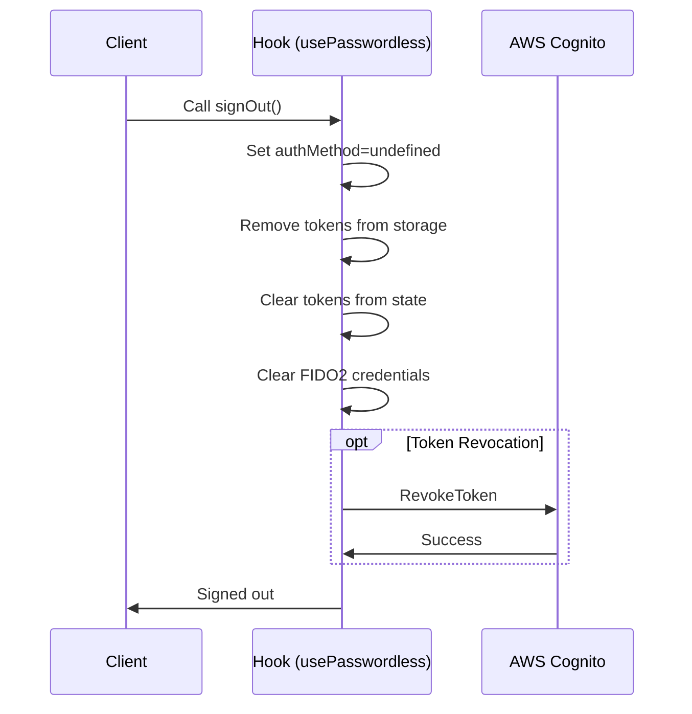
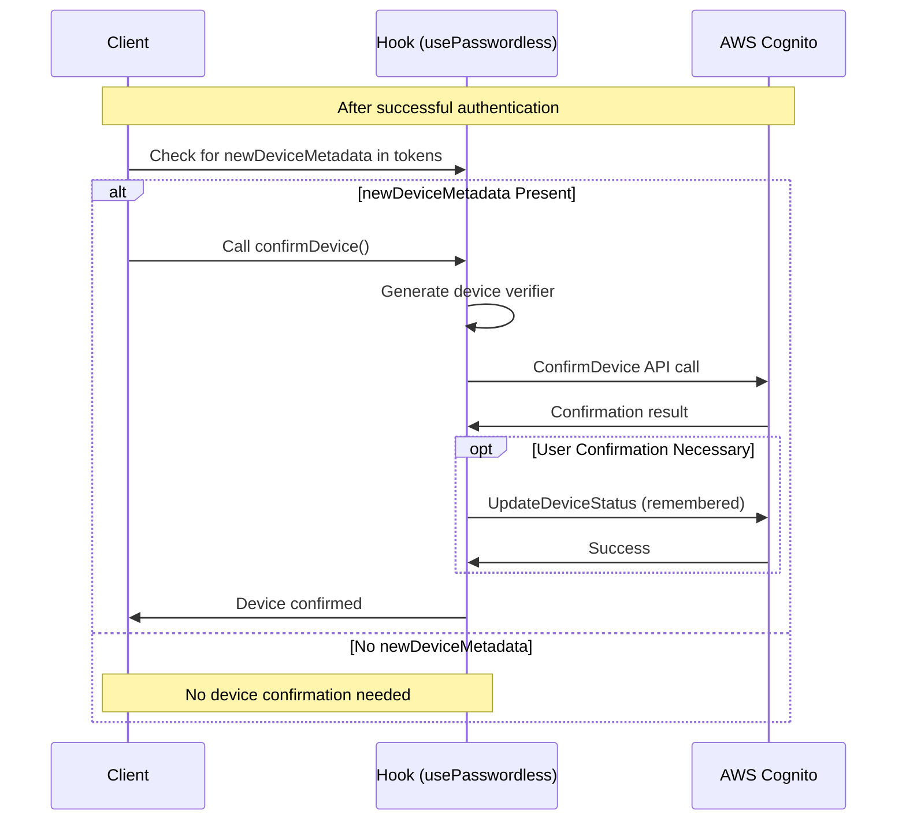

# Amazon Cognito Passwordless Auth - React Client

> **_NOTE:_** This page describes the React-specific features of this library. You can also use the [generic JavaScript](../README.md) features in React.

## Table of Contents

1. [Overview](#overview)
2. [Getting Started](#getting-started)
   - [Considerations](#considerations)
   - [Installation](#installation)
   - [Configuration](#configuration)
3. [React Components](#react-components)
   - [PasswordlessContextProvider](#passwordlesscontextprovider)
   - [Passwordless Component](#passwordless-component)
   - [Fido2Toast Component](#fido2toast-component)
4. [React Hooks](#react-hooks)
   - [usePasswordless Hook](#usepasswordless-hook)
   - [useLocalUserCache Hook](#uselocalusercache-hook)
5. [Authentication Methods](#authentication-methods)
   - [FIDO2 Authentication](#fido2-authentication)
   - [SRP Authentication](#srp-authentication)
   - [Plaintext Password Authentication](#plaintext-password-authentication)
   - [Device Authentication](#device-authentication)
6. [Authentication Flows](#authentication-flows)
7. [Advanced Usage](#advanced-usage)
8. [Troubleshooting](#troubleshooting)

## Overview

Upon deploying the backend (with the `Passwordless` CDK construct), custom authentication flows are added to your Amazon Cognito User Pool, and your front-end will need to initiate and "dance" along in the Passwordless choreography to sign users in. This library provides a hook and sample components to make that easy:

- **React Hooks**: The primary hook `usePasswordless` provides all functionality to sign-in with FIDO2 (biometrics like Face ID or Touch ID) and SRP (Secure Remote Password).
- **Sample React components**—to get started quickly and for inspiration to build your own:
  - `<Passwordless />`: Sample component that renders a login page, allowing the user to authenticate with FIDO2 or username/password
  - `<Fido2Toast />`: Sample component (a "toast" at the top of the page) that (1) recommends to add a FIDO2 credential if the user doesn't yet have one and (2) shows the user's registered FIDO2 credentials

A good way to see it in action and play around is to deploy the [end-to-end example](../../end-to-end-example) into your own AWS account. You can run the accompanying front end locally, and sign-in with FIDO2 and SRP.

## Getting Started

### Considerations

- This library supports React 17.0+ and to be able to use it, you must have your [environment properly setup for react](https://reactjs.org/docs/getting-started.html).
- As the time of writing, WebAuthn is natively supported on Chrome, Firefox, Microsoft Edge and Safari. However, browsers differ in their level of support (see also [fido2-browser-support](../../FIDO2.md#fido2-browser-support)).

### Installation

This library is published as a npm package under `amazon-cognito-passwordless-auth` name. Install it by running the following command:

```bash
npm install amazon-cognito-passwordless-auth
```

### Configuration

To use the library, you need to first import and configure it, and then wrap your app with the `PasswordlessContextProvider`.

1. **Configure the library** in your web app's entrypoint (e.g. `main.tsx`):

```javascript
import { configure } from "amazon-cognito-passwordless-auth";

configure({
  cognitoIdpEndpoint: "eu-west-1", // Region or full endpoint URL
  clientId: "<client id>",
  // Optional, required only if you want to use FIDO2:
  fido2: {
    baseUrl: "<fido2 base url>",
    // Optional FIDO2 configuration parameters:
    authenticatorSelection: {
      userVerification: "required",
      requireResidentKey: true,
      residentKey: "preferred",
      authenticatorAttachment: "platform",
    },
    rp: {
      id: "example.com",
      name: "Example",
    },
    timeout: 120000,
  },
  userPoolId: "<user pool id>", // Required for SRP authentication
  // TOTP MFA configuration (defaults to "YourApp" if not provided):
  totp: {
    issuer: "YourCompany", // The name that will appear in authenticator apps
  },
  // Optional headers for Cognito requests:
  proxyApiHeaders: {
    "<header name>": "<header value>",
  },
  storage: localStorage, // Default is localStorage
});
```

2. **Wrap your app with the providers**:

```jsx
import {
  PasswordlessContextProvider,
  Passwordless as PasswordlessComponent,
  Fido2Toast,
} from "amazon-cognito-passwordless-auth/react";
import "amazon-cognito-passwordless-auth/passwordless.css";

ReactDOM.createRoot(document.getElementById("root")).render(
  <PasswordlessContextProvider>
    <PasswordlessComponent
      brand={{
        backgroundImageUrl: "<url>",
        customerName: "ACME corp.",
        customerLogoUrl: "<url>",
      }}
    >
      <App />
    </PasswordlessComponent>
    <Fido2Toast />
  </PasswordlessContextProvider>
);
```

You can resize the `Passwordless` component by overriding the `.passwordless-main-container` class:

```css
.passwordless-main-container {
  height: 100vh !important;
}
```

## React Components

### PasswordlessContextProvider

This component provides the React context for the Passwordless library. It's required to wrap your app to use any of the hooks.

```jsx
<PasswordlessContextProvider enableLocalUserCache={true}>
  <App />
</PasswordlessContextProvider>
```

Props:

- `enableLocalUserCache` (optional): Enable storing recently signed-in users
- `children`: Your application components

### Passwordless Component

A pre-built login component that supports signing in with FIDO2 and username/password. It shows the last signed-in user on this device, so they can sign in again without entering their username:


Users can also sign in with their Passkey, without typing their username:


Usage:

```jsx
<Passwordless
  brand={{
    backgroundImageUrl: "url/to/background.jpg",
    customerName: "Your Company",
    customerLogoUrl: "url/to/logo.png",
  }}
>
  <App />
</Passwordless>
```

The component will render your app (the child) once the user signs in. If no child is provided and the user is signed in, it renders a debug utility view:


### Fido2Toast Component

This component renders as a toast at the top right corner of the viewport, with two purposes:

1. **Recommend FIDO2 credential creation** if the user doesn't have one yet
2. **Manage FIDO2 credentials** - view, update, delete, and add credentials

Add it at the top level of your app, below other components so it can render on top:

```jsx
<PasswordlessContextProvider>
  <App />
  <Fido2Toast />
</PasswordlessContextProvider>
```

#### FIDO2 Credential Recommendation

The recommendation appears automatically if the user:

- Signed in with a method other than FIDO2
- Doesn't have any FIDO2 credentials set up
- Has a compatible platform authenticator available


When the user clicks "Add face or touch unlock", they'll provide the biometric gesture and name their credential:


After completion, FIDO2 is activated for future sign-ins:


#### FIDO2 Credential Manager

The credential manager appears when you call `toggleShowAuthenticatorManager()` from the `usePasswordless` hook:


```jsx
function ManageCredentialsButton() {
  const { toggleShowAuthenticatorManager } = usePasswordless();

  return (
    <button onClick={toggleShowAuthenticatorManager}>
      Manage FIDO2 Credentials
    </button>
  );
}
```

## React Hooks

### usePasswordless Hook

This hook provides access to all authentication functionality. It must be used within a component wrapped by `PasswordlessContextProvider`.

```jsx
import { usePasswordless } from "amazon-cognito-passwordless-auth/react";

function MyComponent() {
  const {
    // Authentication methods
    authenticateWithFido2, // Sign in with biometrics/security key
    authenticateWithSRP, // Sign in with username/password (secure)
    authenticateWithPlaintextPassword, // Sign in with username/password (less secure)
    signOut, // Sign out the current user

    // FIDO2 management
    fido2CreateCredential, // Register a new FIDO2 credential
    fido2Credentials, // Array of user's registered FIDO2 credentials
    creatingCredential, // Boolean: true during credential creation
    userVerifyingPlatformAuthenticatorAvailable, // Boolean: is Face/Touch ID available?
    showAuthenticatorManager, // Boolean: should credential manager be shown?
    toggleShowAuthenticatorManager, // Toggle the credential manager visibility

    // Device authentication
    deviceKey, // Current device key for remembered device
    confirmDevice, // Confirm device for trusted authentication
    forgetDevice, // Stop using a device for trusted authentication
    clearDeviceKey, // Clear the stored device key

    // Tokens and refresh
    tokens, // Raw JWT tokens (idToken, accessToken, refreshToken)
    tokensParsed, // Parsed JWT tokens with user information
    refreshTokens, // Force token refresh
    isRefreshingTokens, // Boolean: true during token refresh

    // Status and errors
    signInStatus, // Overall auth status: "SIGNED_IN", "NOT_SIGNED_IN", etc.
    signingInStatus, // Current auth action status
    busy, // Boolean: true during authentication operations
    lastError, // Last error that occurred during authentication
  } = usePasswordless();

  // Your component logic here
}
```

#### Key Authentication Methods

```jsx
// FIDO2 Authentication
authenticateWithFido2({
  username, // Optional: username or alias
  credentials, // Optional: array of credentials to use
  clientMetadata, // Optional: metadata for the request
});

// SRP Authentication (secure password)
authenticateWithSRP({
  username, // Username or alias
  password, // User's password
  smsMfaCode, // Optional: function returning SMS MFA code
  otpMfaCode, // Optional: function returning OTP MFA code
  clientMetadata, // Optional: metadata for the request
});

// Plaintext Password Authentication
authenticateWithPlaintextPassword({
  username, // Username or alias
  password, // User's password
  smsMfaCode, // Optional: function returning SMS MFA code
  otpMfaCode, // Optional: function returning OTP MFA code
  clientMetadata, // Optional: metadata for the request
});

// Sign Out
signOut({
  skipTokenRevocation, // Optional: skip token revocation (default: false)
});
```

#### Sign-In Status Values

The `signInStatus` property can have these values:

- `"SIGNED_IN"`: User is authenticated
- `"NOT_SIGNED_IN"`: User is not authenticated
- `"CHECKING"`: Checking stored tokens
- `"REFRESHING_SIGN_IN"`: Refreshing the authentication tokens
- `"SIGNING_IN"`: Authentication in progress
- `"SIGNING_OUT"`: Sign-out in progress

The more detailed `signingInStatus` property can have these values:

- `"SIGNED_OUT"`: User is not authenticated
- `"STARTING_SIGN_IN_WITH_FIDO2"`: Beginning FIDO2 authentication
- `"COMPLETING_SIGN_IN_WITH_FIDO2"`: Completing FIDO2 authentication 
- `"SIGNED_IN_WITH_FIDO2"`: Successfully authenticated with FIDO2
- `"FIDO2_SIGNIN_FAILED"`: FIDO2 authentication failed
- `"SIGNING_IN_WITH_PASSWORD"`: Authenticating with password
- `"SIGNED_IN_WITH_SRP_PASSWORD"`: Successfully authenticated with SRP
- `"SIGNED_IN_WITH_PLAINTEXT_PASSWORD"`: Successfully authenticated with plaintext password
- `"PASSWORD_SIGNIN_FAILED"`: Password authentication failed
- `"SIGNING_IN_WITH_OTP"`: Authenticating with one-time password
- `"SIGNED_IN_WITH_OTP"`: Successfully authenticated with OTP
- `"SIGNIN_WITH_OTP_FAILED"`: OTP authentication failed
- `"SIGNING_OUT"`: Sign-out in progress
- `"AUTHENTICATING_WITH_DEVICE"`: Authenticating with a remembered device

### useLocalUserCache Hook

This hook provides access to the list of recently signed-in users. To use it, enable the local user cache in the `PasswordlessContextProvider`:

```jsx
<PasswordlessContextProvider enableLocalUserCache={true}>
  <App />
</PasswordlessContextProvider>
```

Then use the hook:

```jsx
import { useLocalUserCache } from "amazon-cognito-passwordless-auth/react";

function RecentUsersComponent() {
  const {
    currentUser, // Current signed-in user details
    lastSignedInUsers, // Array of recently signed-in users
    clearLastSignedInUsers, // Function to clear the user cache
    updateFidoPreference, // Update FIDO2 preference for current user
    signingInStatus, // Current authentication status
    authMethod, // Current authentication method
  } = useLocalUserCache();

  if (!lastSignedInUsers) return <div>Loading users...</div>;

  return (
    <div>
      <h2>Recent Users</h2>
      <ul>
        {lastSignedInUsers.map((user) => (
          <li key={user.username}>{user.username}</li>
        ))}
      </ul>
      <button onClick={clearLastSignedInUsers}>Clear Recent Users</button>
    </div>
  );
}
```

### useAwaitableState Hook

Helper hook to convert React state into a Promise that can be awaited:

```jsx
import { useAwaitableState } from "amazon-cognito-passwordless-auth/react";

function MfaPrompt() {
  const [code, setCode] = useState("");
  const {
    awaitable, // Function to get the Promise
    resolve, // Function to resolve the Promise with current state
    reject, // Function to reject the Promise
    awaited, // Value once Promise is resolved
  } = useAwaitableState(code);

  // Example: Create a function that returns a Promise for the code
  const getCode = () => awaitable();

  // When user submits the form
  const handleSubmit = () => resolve(); // Resolves with current code value

  return (
    <form onSubmit={handleSubmit}>
      <input
        type="text"
        value={code}
        onChange={(e) => setCode(e.target.value)}
        placeholder="Enter MFA code"
      />
      <button type="submit">Submit</button>
    </form>
  );
}
```

### useTotpMfa Hook

Hook for managing TOTP (Time-based One-Time Password) MFA setup and verification:

```jsx
import { useTotpMfa } from "amazon-cognito-passwordless-auth/react";

function TotpSetupComponent() {
  const {
    setupStatus, // IDLE, GENERATING, READY, VERIFYING, VERIFIED, ERROR
    secretCode, // The TOTP secret code to display to the user
    qrCodeUrl, // URL for QR code that can be scanned (uses configured issuer name)
    errorMessage, // Error message if any
    beginSetup, // Function to start the TOTP setup process
    verifySetup, // Function to verify the TOTP code
    resetSetup, // Function to reset the setup process
  } = useTotpMfa();

  // The issuer name can be configured (defaults to "YourApp"):
  // configure({ totp: { issuer: "YourCompany" } })

  return (
    <div>
      {setupStatus === "IDLE" && (
        <button onClick={beginSetup}>Set up TOTP MFA</button>
      )}

      {setupStatus === "READY" && secretCode && (
        <div>
          <p>Secret code: {secretCode}</p>
          {qrCodeUrl && }
          <button onClick={() => verifySetup(prompt("Enter code"))}>
            Verify Code
          </button>
        </div>
      )}

      {setupStatus === "VERIFIED" && <p>TOTP MFA setup complete!</p>}

      {errorMessage && <p>Error: {errorMessage}</p>}
    </div>
  );
}
```

## Authentication Methods

### FIDO2 Authentication

Sign in with biometrics (Face ID, Touch ID) or security keys.

```jsx
function Fido2Login() {
  const { authenticateWithFido2 } = usePasswordless();

  const handleLogin = (username) => {
    authenticateWithFido2({ username });
  };

  return (
    <button onClick={() => handleLogin("user@example.com")}>
      Sign in with Face/Touch ID
    </button>
  );
}
```

### SRP Authentication

Secure Remote Password - sign in with username/password without sending the password.

```jsx
function PasswordLogin() {
  const { authenticateWithSRP } = usePasswordless();

  const handleSubmit = (event) => {
    event.preventDefault();
    authenticateWithSRP({
      username: event.target.username.value,
      password: event.target.password.value,
    });
  };

  return (
    <form onSubmit={handleSubmit}>
      <input name="username" type="text" required />
      <input name="password" type="password" required />
      <button type="submit">Sign In</button>
    </form>
  );
}
```

### Plaintext Password Authentication

Authentication using plaintext password (less secure).

```jsx
function PlaintextLogin() {
  const { authenticateWithPlaintextPassword } = usePasswordless();

  // Similar to SRP but uses authenticateWithPlaintextPassword
}
```

### Device Authentication

Enable trusted device to bypass MFA on future sign-ins.

```jsx
function RememberDevice() {
  const { tokens, confirmDevice } = usePasswordless();

  const handleRememberDevice = async () => {
    if (tokens?.newDeviceMetadata) {
      await confirmDevice("My Laptop");
      console.log("Device remembered for future sign-ins");
    }
  };

  return <button onClick={handleRememberDevice}>Remember this device</button>;
}
```

## Authentication Flows

The library supports several authentication methods, each with its own flow and characteristics. This section visualizes how each flow works.

### Authentication Methods Comparison

| Method          | Security                               | User Experience                       | Requirements                                   | Use Case                                   |
| --------------- | -------------------------------------- | ------------------------------------- | ---------------------------------------------- | ------------------------------------------ |
| **FIDO2**       | Highest - No passwords transmitted     | Excellent - One tap/face scan         | Browser WebAuthn support, FIDO2 API configured | Primary auth method for returning users    |
| **SRP**         | High - Password not sent in plaintext  | Good - Username/password required     | UserPoolId configured                          | Password-based auth with enhanced security |
| **Plaintext**   | Lower - Password sent over TLS         | Good - Username/password required     | None                                           | Fallback when SRP not configured           |
| **Device Auth** | Supplementary - Enhances existing auth | Excellent - Skip MFA on known devices | Prior successful auth                          | Reduce friction for returning users        |

### SRP Authentication Flow

Secure Remote Password (SRP) authentication allows users to authenticate with a username and password without sending the password over the network.



When using SRP authentication, the library now specifically prevents any FIDO2-related operations to avoid unnecessary API calls and potential errors. This is done by:

1. Setting `authMethod` to "SRP"
2. Clearing any existing FIDO2 credentials
3. Preventing FIDO2 credential checks in both the main hook and user cache

### FIDO2 Authentication Flow

FIDO2 (WebAuthn) authentication allows users to authenticate using biometrics or security keys without typing a password.



After successful FIDO2 authentication, the library automatically fetches the user's registered FIDO2 credentials to make them available through the `fido2Credentials` property.

### Plaintext Password Authentication Flow

This method sends the password directly to Cognito. It's less secure than SRP but may be necessary in some situations.



### Token Refresh Flow

The library automatically handles token refresh, but you can also manually refresh tokens when needed.



### Sign Out Flow

Signing out removes tokens from storage and optionally revokes the refresh token from Cognito.



### Device Authentication Flow

Device authentication allows users to bypass MFA on subsequent sign-ins when using a remembered device.



### Authentication Status Management

The library tracks authentication state through several variables:

- `signInStatus`: The overall auth status (e.g., "SIGNED_IN", "NOT_SIGNED_IN")
- `signingInStatus`: Status of current auth action (e.g., "SIGNING_IN_WITH_PASSWORD", "SIGNED_IN_WITH_SRP_PASSWORD", "SIGNED_IN_WITH_PLAINTEXT_PASSWORD")
- `authMethod`: The method used for authentication ("SRP", "FIDO2", "PLAINTEXT")
- `busy`: Whether an authentication operation is in progress

The library uses specific status values to distinguish between different authentication methods:
- SRP authentication uses "SIGNED_IN_WITH_SRP_PASSWORD" for successful authentication
- Plaintext authentication uses "SIGNED_IN_WITH_PLAINTEXT_PASSWORD" for successful authentication
- FIDO2 authentication uses "SIGNED_IN_WITH_FIDO2" for successful authentication

This distinction is important because it helps prevent operations specific to one authentication method (like FIDO2 credential listing) from running when another method is used. The `useLocalUserCache` hook maps these status values to the appropriate `authMethod` to maintain consistent behavior.

This state management ensures that UI components can react appropriately to authentication events and prevent conflicting operations.

## Advanced Usage

Implement intelligent auth method selection based on user context:

```jsx
import {
  usePasswordless,
  useLocalUserCache,
} from "amazon-cognito-passwordless-auth/react";
import { configure } from "amazon-cognito-passwordless-auth";

function AuthDecisionFlow({ username, password }) {
  const {
    authenticateWithSRP,
    authenticateWithFido2,
    authenticateWithPlaintextPassword,
    confirmDevice,
    fido2Credentials,
  } = usePasswordless();

  // Determine available authentication methods
  const hasFido2Credentials = fido2Credentials && fido2Credentials.length > 0;
  const hasPassword = !!password;
  const isSrpConfigured = !!configure().userPoolId;

  const handleAuth = async () => {
    try {
      let authResult;

      // Choose the best authentication method
      if (hasFido2Credentials) {
        authResult = await authenticateWithFido2({ username }).signedIn;
      } else if (hasPassword) {
        if (isSrpConfigured) {
          authResult = await authenticateWithSRP({ username, password })
            .signedIn;
        } else {
          authResult = await authenticateWithPlaintextPassword({
            username,
            password,
          }).signedIn;
        }
      } else {
        // Redirect to sign up
        return;
      }

      // Set up device authentication if available
      if (authResult?.newDeviceMetadata) {
        await confirmDevice("My Device");
      }
    } catch (error) {
      console.error("Authentication failed:", error);
    }
  };

  return <button onClick={handleAuth}>Sign In</button>;
}
```

## Troubleshooting

### Common Issues

#### 404 Errors on `/authenticators/list` During SRP Authentication

**Issue**: 404 errors for `/authenticators/list` endpoints after SRP authentication.

**Solution**: This occurs when FIDO2 is not properly configured. Version 1.0.0+ prevents this automatically. If you still see this:

1. Update to the latest version:
   ```bash
   npm list amazon-cognito-passwordless-auth  # Check current version
   npm install amazon-cognito-passwordless-auth@latest
   ```
2. Verify you're using `authenticateWithSRP`
3. Check that `authMethod` is correctly set to `"SRP"`

#### Multiple Token Revocation Calls

**Issue**: Multiple calls to `revokeToken` API during sign-out.

**Solution**: Version 1.0.0+ includes protection against duplicate revocation. If still occurring:

1. Use `skipTokenRevocation: true` with `signOut()`
2. Add error handling for authentication failures
3. Avoid rapid sign-in/out sequences

#### Authentication State Conflicts

**Issue**: Confused authentication state between methods.

**Solution**:

1. Ensure each auth method properly sets the `authMethod` state
2. Check the specific status values like "SIGNED_IN_WITH_SRP_PASSWORD" vs "SIGNED_IN_WITH_PLAINTEXT_PASSWORD" to determine which authentication method was used
3. Don't mix authentication methods in the same flow
4. Wait for operations to complete before starting new ones
5. If implementing custom authentication flows, ensure you're mapping the specific status values to the correct `authMethod` value

#### FIDO2 Credential Prompts Appearing Unexpectedly

**Issue**: FIDO2 credential prompts after SRP authentication.

**Solution**:

1. `authMethod` state prevents FIDO2 suggestions for SRP
2. `Fido2Toast` component respects this state
3. Control FIDO2 preference with `updateFidoPreference`

#### Token Refresh Failures

**Issue**: Token refresh fails, causing sign-out.

**Solution**:

1. Implement error handling for refresh failures
2. Consider a retry mechanism for refresh
3. Provide clear feedback when sessions expire

### FAQ

**Q: Can I use both FIDO2 and password authentication?**  
A: Yes, you can implement both and let users choose, or intelligently select the best method.

**Q: What happens if a user's device doesn't support FIDO2?**  
A: The `userVerifyingPlatformAuthenticatorAvailable` property will be `false`, and you can fall back to password authentication.

**Q: Can I customize the UI components?**  
A: Yes, the sample components are for reference - you can build your own UI using the hooks.

**Q: How do I handle sign-up flows?**  
A: Use the standard Cognito sign-up methods, then implement passwordless authentication.

## Examples

A complete example implementation is available in the [end-to-end example](../../end-to-end-example) directory:

- [main.tsx](../../end-to-end-example/client/src/main.tsx) - Library configuration and provider setup
- [App.tsx](../../end-to-end-example/client/src/App.tsx) - Using the `usePasswordless` hook for sign-in status and user interface
