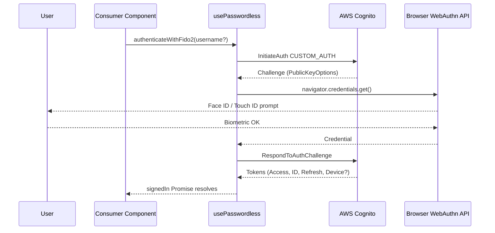
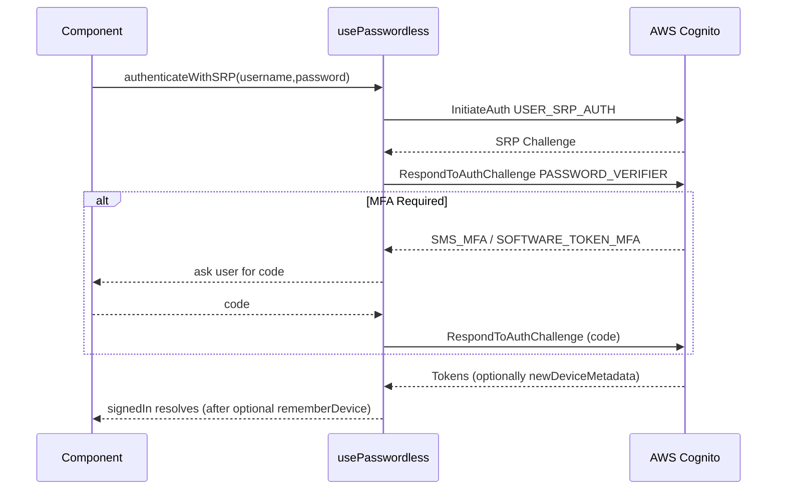
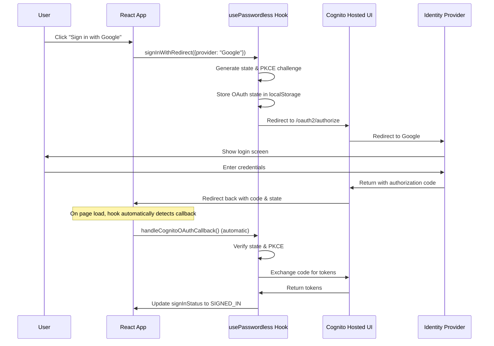
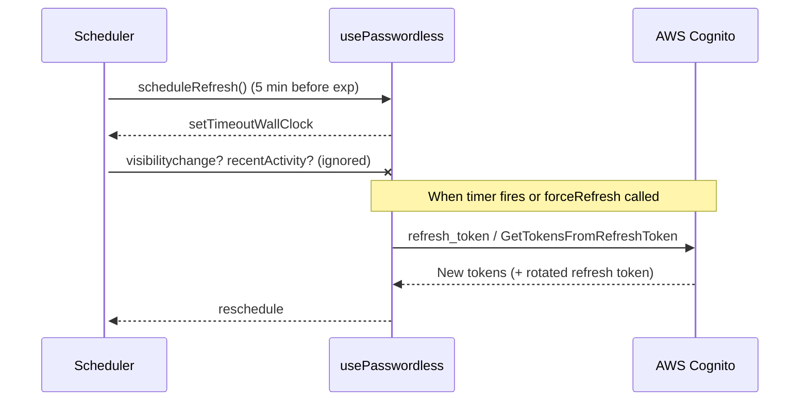
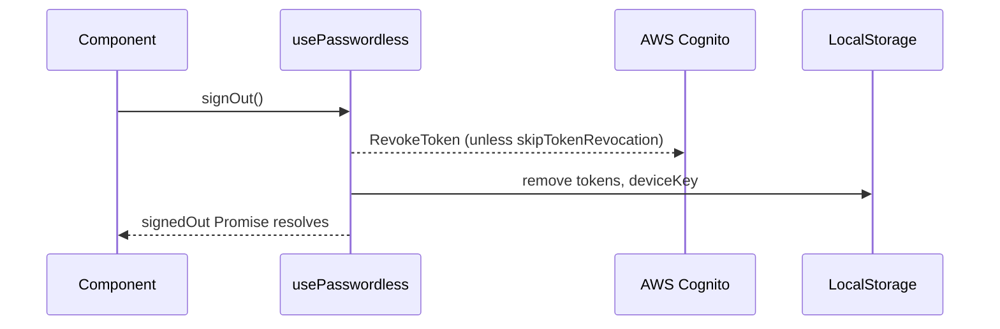

# Meow Cognito Passwordless Auth – React Client

> A tiny wrapper around the core **@joinmeow/cognito-passwordless-auth** library that gives you first-class React hooks and components.
>
> • React 17+
> • TypeScript friendly
> • Works with **FIDO2 / WebAuthn**, **SRP (Secure Remote Password)**, Cognito **Hosted-UI** providers (Google, Apple …) and regular plaintext passwords.

---

## 1 Install & Configure

```bash
npm i @joinmeow/cognito-passwordless-auth
```

```tsx
// main.tsx
import { configure } from "@joinmeow/cognito-passwordless-auth";
import { PasswordlessContextProvider } from "@joinmeow/cognito-passwordless-auth/react";

configure({
  clientId: "<USER_POOL_CLIENT_ID>",
  cognitoIdpEndpoint: "eu-west-1", // Region or custom endpoint
  userPoolId: "<USER_POOL_ID>", // Needed for SRP
  fido2: {
    baseUrl: "<API Gateway URL>/fido2", // Required for WebAuthn
    rp: { id: "example.com", name: "Example" },
  },
  hostedUi: {
    domain: "example.auth.eu-west-1.amazoncognito.com",
    redirectSignIn: "http://localhost:5173/",
  },
  totp: { issuer: "Example" }, // Optional – TOTP MFA
  debug: console.log, // See what happens under the hood
});

ReactDOM.createRoot(document.getElementById("root")!).render(
  <PasswordlessContextProvider>
    <App />
  </PasswordlessContextProvider>
);
```

---

## 2 Quick Tour of the Hook

```tsx
const {
  /* sign-in */
  authenticateWithFido2,
  authenticateWithSRP,
  authenticateWithPlaintextPassword,
  signInWithRedirect, // Cognito Hosted-UI (e.g. Google)

  /* tokens */
  tokens,
  tokensParsed,
  refreshTokens,
  forceRefreshTokens,
  isRefreshingTokens,

  /* device auth */
  deviceKey,
  confirmDevice,
  forgetDevice,
  clearDeviceKey,

  /* FIDO2 */
  fido2Credentials,
  creatingCredential,
  fido2CreateCredential,

  /* MFA */
  totpMfaStatus,

  /* status */
  signInStatus,
  signingInStatus,
  busy,
  lastError,
} = usePasswordless();
```

Common `signInStatus` values:

| Value           | Meaning                     |
| --------------- | --------------------------- |
| `CHECKING`      | reading tokens from storage |
| `SIGNED_IN`     | valid tokens in memory      |
| `NOT_SIGNED_IN` | no (or expired) tokens      |

---

## 3 Authentication Flows (High-level)

Below diagrams mirror the actual TypeScript implementation in `client/`. Dashed arrows are **optional** messages.

### 3.1 FIDO2 / WebAuthn



### 3.2 SRP Password



### 3.3 Hosted UI Redirect (Google, Apple, OIDC)

#### Basic Usage

```tsx
const { signInWithRedirect } = usePasswordless();

// Sign in with Google (default)
signInWithRedirect();

// Sign in with specific provider
signInWithRedirect({ provider: "Facebook" });

// Sign in with custom state (preserved through OAuth flow)
signInWithRedirect({
  provider: "Google",
  customState: JSON.stringify({ returnTo: "/dashboard" }),
});

// Sign in with additional OAuth parameters
signInWithRedirect({
  provider: "COGNITO", // Direct Cognito login
  oauthParams: {
    prompt: "login", // Force re-authentication
    login_hint: "user@example.com",
  },
});
```

#### Configuration Requirements

```tsx
configure({
  // ... other config ...
  hostedUi: {
    // Your Cognito domain (without https://)
    domain: "example.auth.eu-west-1.amazoncognito.com",

    // Redirect URI - must be registered in Cognito app client
    // Can be relative path (converted to absolute) or full URL
    redirectSignIn: "/", // or "http://localhost:5173/"

    // Optional: OAuth scopes (defaults shown)
    scopes: ["openid", "email", "profile"],

    // Optional: Response type (default: "code" for PKCE flow)
    responseType: "code",
  },
});
```

#### OAuth Flow



#### Callback Handling

The OAuth callback is **automatically handled** by the hook on page load. You don't need to call any function manually. The hook:

1. Detects OAuth callback parameters in the URL
2. Validates the OAuth state for security
3. Exchanges the authorization code for tokens
4. Stores tokens and updates the sign-in state
5. Cleans up OAuth parameters from the URL

#### Sign-In Status During OAuth Flow

```tsx
const { signInStatus, signingInStatus } = usePasswordless();

// Status progression during OAuth:
// 1. "NOT_SIGNED_IN" → Initial state
// 2. "STARTING_SIGN_IN_WITH_REDIRECT" → After calling signInWithRedirect()
// 3. [User redirected to Cognito/Provider]
// 4. "STARTING_SIGN_IN_WITH_REDIRECT" → After redirect back
// 5. "SIGNED_IN_WITH_REDIRECT" → After successful token exchange
// 6. "SIGNED_IN" → Final state

// Handle OAuth errors
if (signingInStatus === "SIGNIN_WITH_REDIRECT_FAILED") {
  console.error("OAuth sign-in failed:", lastError);
}
```

#### Common Provider Values

- `"COGNITO"` - Direct Cognito username/password login via Hosted UI
- `"Google"` - Google OAuth
- `"Facebook"` - Facebook OAuth
- `"LoginWithAmazon"` - Amazon OAuth
- `"Apple"` - Apple Sign In
- Custom OIDC providers configured in your user pool

#### Security Features

- **PKCE (Proof Key for Code Exchange)**: Automatically implemented for authorization code flow
- **State Parameter**: Prevents CSRF attacks, automatically generated and validated
- **Custom State**: Your custom state is encoded and preserved through the flow
- **Lock Protection**: Prevents race conditions during concurrent OAuth operations

#### Error Handling

```tsx
const { lastError, signInStatus } = usePasswordless();

// OAuth errors are captured in lastError
if (lastError?.message.includes("access_denied")) {
  // User cancelled the OAuth flow
}

// The hook automatically cleans up on errors:
// - Removes OAuth state from storage
// - Sets appropriate error status
// - Clears in-progress flags
```

#### Advanced: Custom OAuth Parameters

```tsx
// Force account selection
signInWithRedirect({
  oauthParams: {
    prompt: "select_account",
  },
});

// Pre-fill email
signInWithRedirect({
  oauthParams: {
    login_hint: "user@example.com",
  },
});

// Request additional scopes
signInWithRedirect({
  oauthParams: {
    scope: "openid email profile aws.cognito.signin.user.admin",
  },
});
```

### 3.4 Token Lifecycle



### 3.5 Sign Out



---

## 4 Device Authentication (“Remember this device?”)

After a successful **MFA**-protected sign-in Cognito may return `newDeviceMetadata`.

```tsx
const { tokens, confirmDevice } = usePasswordless();

if (tokens?.newDeviceMetadata) {
  const ok = await confirm("Remember this device?");
  if (ok) await confirmDevice("My Laptop 2024");
}
```

Subsequent sign-ins from the same device include the `deviceKey` and Cognito skips the MFA challenge.

---

## 5 TOTP MFA Setup

```tsx
const {
  setupStatus,
  secretCode,
  qrCodeUrl,
  beginSetup,
  verifySetup,
  resetSetup,
} = useTotpMfa();
```

- `beginSetup()` → gets secret + QR code
- call `verifySetup("123456")` after user enters code
- state machine in `setupStatus` (IDLE → GENERATING → READY → VERIFYING → VERIFIED)

---

## 6 Local User Cache (optional)

Enables a "last 10 users" switcher:

```tsx
<PasswordlessContextProvider enableLocalUserCache>
  …
</PasswordlessContextProvider>
```

`useLocalUserCache()` exposes `currentUser`, `lastSignedInUsers`, `updateFidoPreference()` and more.

---

## 7 Troubleshooting

| Symptom                              | Fix                                                                          |
| ------------------------------------ | ---------------------------------------------------------------------------- |
| Infinite refresh loop                | Verify system clock & check `configure({ debug })` output                    |
| 404 `/authenticators/list` after SRP | Don't call FIDO APIs when `authMethod === "SRP"` (library already does this) |
| Multiple `RevokeToken`s              | Pass `skipTokenRevocation:true` to `signOut()` if you handle it yourself     |
| "Invalid refresh token"              | User signed out on another device → catch error, call `signOut()`            |

---

## 8 Contributing & License

Apache-2.0 © Amazon.com, Inc. and its affiliates.

This is a fork by Meow Technologies Inc. (https://meow.com), based on the original work by Amazon. All modifications are also licensed under Apache-2.0.

Pull requests are welcome – run `npm test` before submitting.
