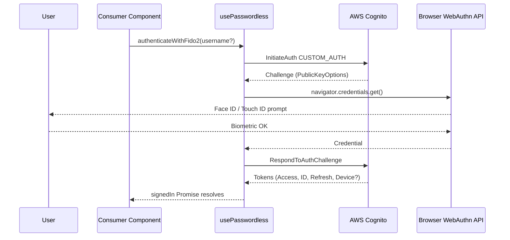
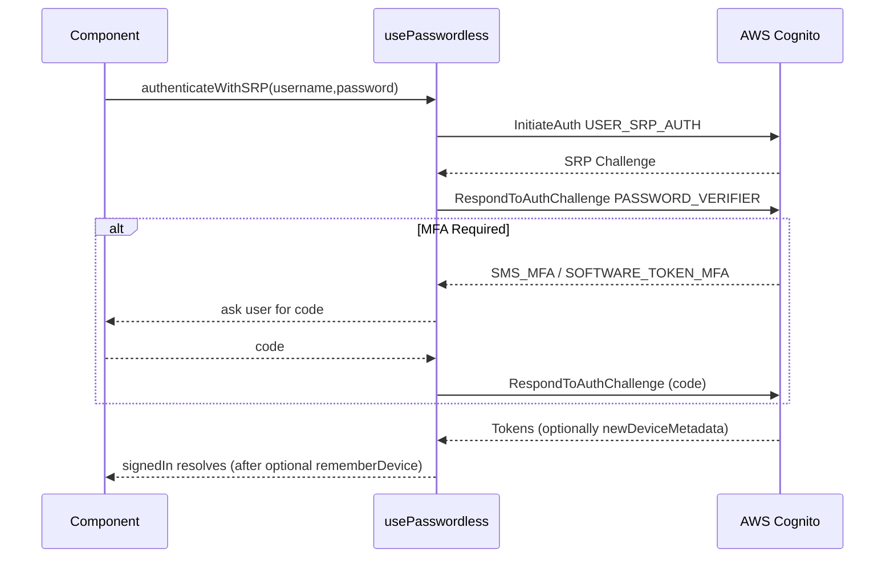
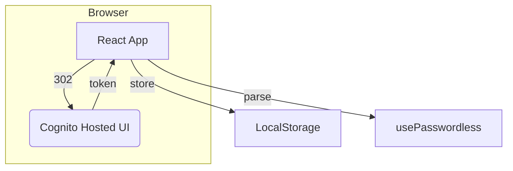
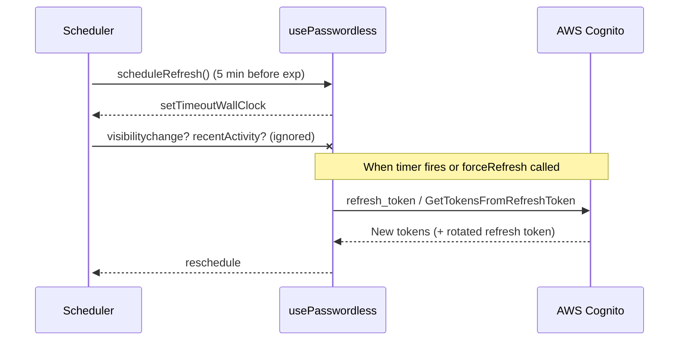
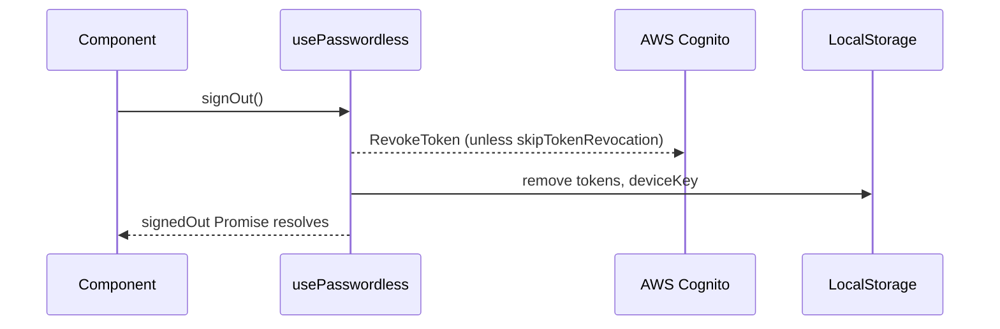

# Meow Cognito Passwordless Auth – React Client

> A tiny wrapper around the core **@joinmeow/cognito-passwordless-auth** library that gives you first-class React hooks and components.
>
> • React 17+
> • TypeScript friendly
> • Works with **FIDO2 / WebAuthn**, **SRP (Secure Remote Password)**, Cognito **Hosted-UI** providers (Google, Apple …) and regular plaintext passwords.

---

## 1 Install & Configure

```bash
npm i @joinmeow/cognito-passwordless-auth
```

```tsx
// main.tsx
import { configure } from "@joinmeow/cognito-passwordless-auth";
import { PasswordlessContextProvider } from "@joinmeow/cognito-passwordless-auth/react";

configure({
  clientId: "<USER_POOL_CLIENT_ID>",
  cognitoIdpEndpoint: "eu-west-1", // Region or custom endpoint
  userPoolId: "<USER_POOL_ID>", // Needed for SRP
  fido2: {
    baseUrl: "<API Gateway URL>/fido2", // Required for WebAuthn
    rp: { id: "example.com", name: "Example" },
  },
  hostedUi: {
    domain: "example.auth.eu-west-1.amazoncognito.com",
    redirectUriSignIn: "http://localhost:5173/",
  },
  totp: { issuer: "Example" }, // Optional – TOTP MFA
  debug: console.log, // See what happens under the hood
});

ReactDOM.createRoot(document.getElementById("root")!).render(
  <PasswordlessContextProvider>
    <App />
  </PasswordlessContextProvider>
);
```

---

## 2 Quick Tour of the Hook

```tsx
const {
  /* sign-in */
  authenticateWithFido2,
  authenticateWithSRP,
  authenticateWithPlaintextPassword,
  signInWithRedirect, // Cognito Hosted-UI (e.g. Google)

  /* tokens */
  tokens,
  tokensParsed,
  refreshTokens,
  forceRefreshTokens,
  isRefreshingTokens,

  /* device auth */
  deviceKey,
  confirmDevice,
  forgetDevice,
  clearDeviceKey,

  /* FIDO2 */
  fido2Credentials,
  creatingCredential,
  fido2CreateCredential,

  /* MFA */
  totpMfaStatus,

  /* status */
  signInStatus,
  signingInStatus,
  busy,
  lastError,
} = usePasswordless();
```

Common `signInStatus` values:

| Value           | Meaning                     |
| --------------- | --------------------------- |
| `CHECKING`      | reading tokens from storage |
| `SIGNED_IN`     | valid tokens in memory      |
| `NOT_SIGNED_IN` | no (or expired) tokens      |

---

## 3 Authentication Flows (High-level)

Below diagrams mirror the actual TypeScript implementation in `client/`. Dashed arrows are **optional** messages.

### 3.1 FIDO2 / WebAuthn



#### Conditional mediation & passkey autofill

```tsx
import { useEffect } from "react";
import { detectMediationCapabilities } from "@joinmeow/cognito-passwordless-auth";
import { usePasswordless } from "@joinmeow/cognito-passwordless-auth/react";

function AutofillSignInButton() {
  const { authenticateWithFido2 } = usePasswordless();

  useEffect(() => {
    (async () => {
      const { conditional } = await detectMediationCapabilities();
      if (!conditional) return;

      // Start conditional mediation on page load (autofill UI)
      authenticateWithFido2({ mediation: "conditional" });
    })();
  }, [authenticateWithFido2]);

  return (
    <button onClick={() => authenticateWithFido2({ mediation: "immediate" })}>
      Sign in with passkey
    </button>
  );
}
```

`detectMediationCapabilities()` safely determines whether the browser supports
conditional (autofill) or immediate (fast fail) mediation modes. Import
`getClientCapabilities()` from the core package if you need the full WebAuthn
capability matrix.

### 3.2 SRP Password



### 3.3 Hosted UI Redirect (Google, Apple, OIDC)



### 3.4 Token Lifecycle



### 3.5 Sign Out



---

## 4 Device Authentication (“Remember this device?”)

After a successful **MFA**-protected sign-in Cognito may return `newDeviceMetadata`.

```tsx
const { tokens, confirmDevice } = usePasswordless();

if (tokens?.newDeviceMetadata) {
  const ok = await confirm("Remember this device?");
  if (ok) await confirmDevice("My Laptop 2024");
}
```

Subsequent sign-ins from the same device include the `deviceKey` and Cognito skips the MFA challenge.

---

## 5 TOTP MFA Setup

```tsx
const {
  setupStatus,
  secretCode,
  qrCodeUrl,
  beginSetup,
  verifySetup,
  resetSetup,
} = useTotpMfa();
```

- `beginSetup()` → gets secret + QR code
- call `verifySetup("123456")` after user enters code
- state machine in `setupStatus` (IDLE → GENERATING → READY → VERIFYING → VERIFIED)

---

## 6 Local User Cache (optional)

Enables a "last 10 users" switcher:

```tsx
<PasswordlessContextProvider enableLocalUserCache>
  …
</PasswordlessContextProvider>
```

`useLocalUserCache()` exposes `currentUser`, `lastSignedInUsers`, `updateFidoPreference()` and more.

---

## 7 Troubleshooting

| Symptom                              | Fix                                                                          |
| ------------------------------------ | ---------------------------------------------------------------------------- |
| Infinite refresh loop                | Verify system clock & check `configure({ debug })` output                    |
| 404 `/authenticators/list` after SRP | Don't call FIDO APIs when `authMethod === "SRP"` (library already does this) |
| Multiple `RevokeToken`s              | Pass `skipTokenRevocation:true` to `signOut()` if you handle it yourself     |
| "Invalid refresh token"              | User signed out on another device → catch error, call `signOut()`            |

---

## 8 Contributing & License

Apache-2.0 © Amazon.com, Inc. and its affiliates.

This is a fork by Meow Technologies Inc. (https://meow.com), based on the original work by Amazon. All modifications are also licensed under Apache-2.0.

Pull requests are welcome – run `npm test` before submitting.
